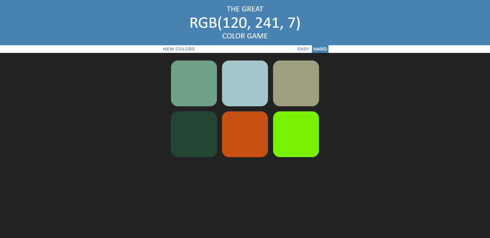

# color-guessing-game

A simple color guessing name with an easy and a hard mode. Every time you play a new game, a random color is generated, and you have to guess with of the boxes is represented with the given color.

Once you press a box, if you've guessed the right color, you win and all the boxes change the color to the correct one. If you miss, the box disappears.

